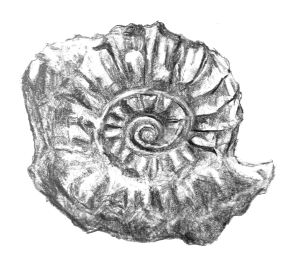

# Worlds Of Observation

## Building more realistic environments for machine learning

**Co-authored by:** Robert J. Hardwick and C. M. Gomez-Perales

Shared by the authors under an [MIT License](LICENSE)

## About

_Worlds Of Observation_ is a book about building more realistic training environments for machine learning algorithms to control systems in the real world. While model-free reinforcement learning is a popular and very powerful approach to generating such algorithms (especially when there is plenty of data and the system is fully observable), this book is better suited to creating algorithms using a more model-based approach. Those readers who are data scientists, research engineers, statistical programmers or computational scientists may find our mathematically descriptive, yet practically-minded, approach in this book quite interesting and a little different to the usual perspectives.

You can read the full book here: [Full Book PDF](book.pdf). For more dynamic visualisations, as well as detailed code documentation, you can also visit the [Worlds Of Observation Webpage](https://worldsofobservation.github.io/).

## Chapters

**Part 1.** Theoretical background and code design

1. [Building a generalised simulator](building_a_generalised_simulator/chapter.pdf)
2. [Numerical time evolution of probabilities](numerical_time_evolution_of_probabilities/chapter.pdf)
3. [Empirical probabilistic reweighting algorithms](empirical_probabilistic_reweighting_algorithms/chapter.pdf)
4. [Generalised simulation inference](generalised_simulation_inference/chapter.pdf)
5. [Interacting with any system](interacting_with_any_system/chapter.pdf)
6. [Optimising actions for control objectives](optimising_actions_for_control_objectives/chapter.pdf)

**Part 2.** Applications to realistic examples

7. [Controlling parasitic infections](controlling_parasitic_infections/chapter.pdf)
8. [Algo-trading on financial markets](algo_trading_on_financial_markets/chapter.pdf)
9. [Sequential experiment design](sequential_experiment_design/chapter.pdf)
10. [Angling for freshwater fish](angling_for_freshwater_fish/chapter.pdf)
11. [Managing a rugby match](managing_a_rugby_match/chapter.pdf)
12. [Optimising relief chain logistics](optimising_relief_chain_logistics/chapter.pdf)